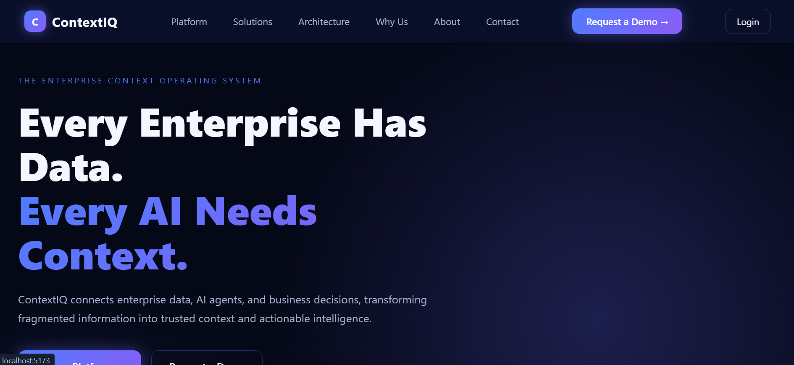
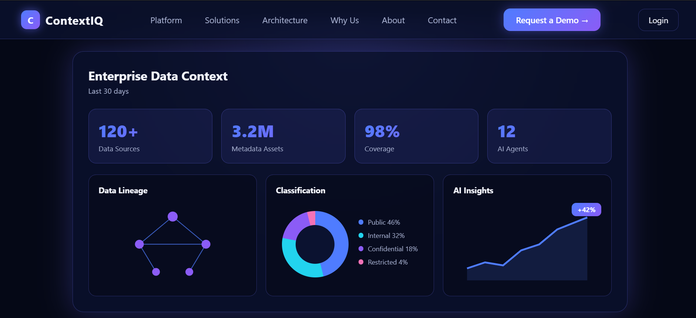
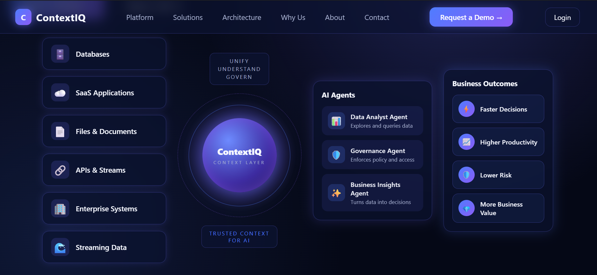
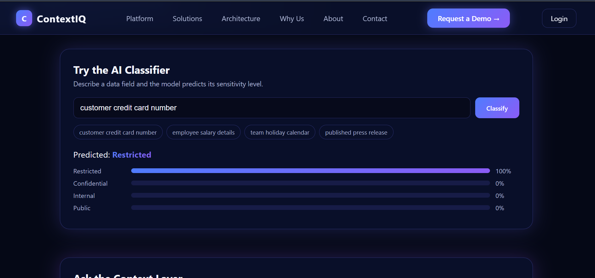
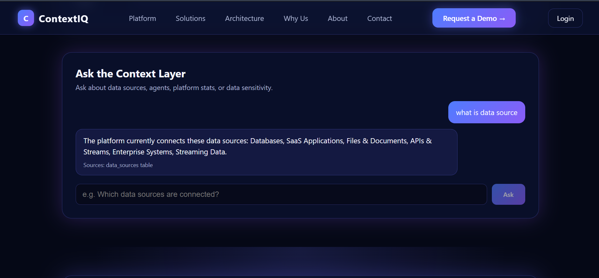

# Enterprise Context & AI Intelligence Platform

A full-stack web application that shows how enterprise data sources feed a central
"context layer" used by AI agents. It includes a dark enterprise dashboard, a REST API,
a MySQL database, JWT authentication, a FastText text classifier that predicts data
sensitivity, and a rule-based assistant that answers questions from live database data.

> Portfolio project. The UI concept is inspired by enterprise data-context platforms;
> all code, data, and visuals are original. Data shown is sample data.

## Screenshots







## Features

- Responsive dark dashboard (desktop, tablet, mobile) with CSS-only visuals
- REST API with Pydantic validation and proper status codes
- MySQL storage through SQLAlchemy
- Admin login with bcrypt-hashed passwords and JWT tokens
- Protected create/delete for data sources through an admin panel
- FastText classifier: predicts Public / Internal / Confidential / Restricted
- "Ask the Context Layer": retrieves live data and answers questions
  (rule-based mock, designed so a real LLM can replace one function)
- Loading and error states, client-side routing

## Tech Stack

| Layer | Technology |
|---|---|
| Frontend | React, Vite, JavaScript, React Router, CSS |
| Backend | Python 3.11, FastAPI, Pydantic, SQLAlchemy |
| Database | MySQL 8 |
| Auth | JWT (PyJWT), bcrypt |
| ML | FastText (fasttext-wheel) |

## Architecture

```
React (Vite)  ->  FastAPI REST API  ->  MySQL
                       |
                       +-> FastText classifier (classifier.bin)
```

## Project Structure

```
frontend/src/   components, pages, services, context, styles
backend/app/    routes, schemas, models, services, ml
```

## Getting Started

### Prerequisites
Python 3.11, Node.js 20+, MySQL 8.

### 1. Database
```sql
CREATE DATABASE context_platform;
CREATE USER 'context_user'@'localhost' IDENTIFIED BY 'your_password';
GRANT ALL PRIVILEGES ON context_platform.* TO 'context_user'@'localhost';
```

### 2. Backend
```bash
cd backend
python -m venv venv
venv\Scripts\activate          # macOS/Linux: source venv/bin/activate
pip install -r requirements.txt
copy .env.example .env         # macOS/Linux: cp .env.example .env
```
Edit `.env` with your password and a secret key
(`python -c "import secrets; print(secrets.token_hex(32))"`), then:
```bash
python -m app.services.seed          # create tables and sample data
python -m app.services.create_admin  # create the admin user
python -m app.ml.train_model         # train the classifier
uvicorn app.main:app --reload
```
API docs: http://127.0.0.1:8000/docs

### 3. Frontend
```bash
cd frontend
npm install
npm run dev
```
Open http://localhost:5173

## API Overview

| Method | Endpoint | Auth |
|---|---|---|
| GET | /api/health, /api/summary, /api/data-sources, /api/agents | No |
| POST | /api/auth/login | No |
| GET | /api/auth/me | Yes |
| POST / PUT / DELETE | /api/data-sources | Yes |
| POST | /api/classify | No |
| POST | /api/ask | No |

## Limitations and Future Work

- Sample data; no real data-source connectors
- The classifier is trained on a small hand-written dataset
- The assistant is rule-based; a real LLM provider could be plugged into `services/llm.py`
- Add automated tests, Docker, and deployment
- Tokens are stored in localStorage; production should use httpOnly cookies

## Author

Jyothi Vempalla